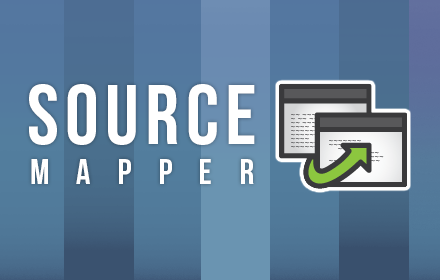
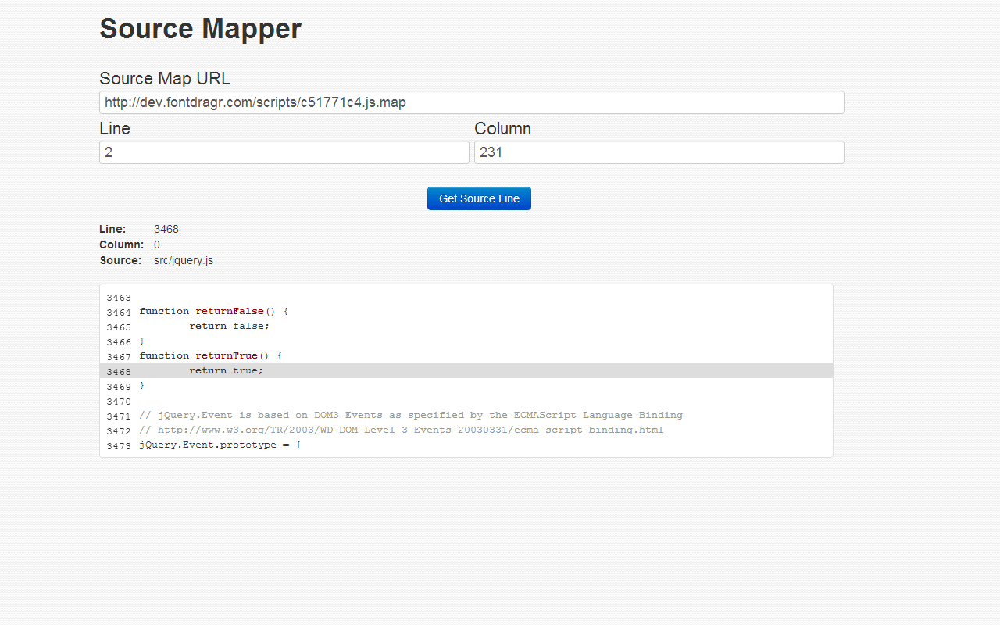

# Source Maps
*/ryansylvestre

!slide
## What is this sourcery?
Language-agnostic way of mapping compiled* / minified code back to an unbuilt state

Most useful for debugging with the original source code

!slide
## When would I want to use this?
Do you minify/combine your JS?

Use a CSS preprocessor?

Ever wanted to use one of those JS Compilers?

!slide
Build systems are now common on client side

!slide
## How do I use it?
Option in most of the popular build tools and compilers/preprocessors

Output is a sourcemap file that you link to in your built code

!slide
## Example
... < minified jquery code > ...

//@ sourceMappingURL=jquery.min.map

!slide
##Browser Support
Chrome - Support for JS, SASS and SCSS

Firefox - Soon? In development

!slide
##Chrome Usage
Enable JS support in devtools settings

Enable support for SASS in chrome://flags - > Enable Devtools Experiments

!slide
## Error logs
Can use in-conjunction with error logging solution

!slide
< Image of otherTool >

!slide

[Chrome Web Store](https://chrome.google.com/webstore/detail/source-mapper/enenhalmnhnpofkecebdmgnmmhfkhcpb)

!slide

!slide
#THANKS!

!slide
# Resources
<http://www.html5rocks.com/en/tutorials/developertools/sourcemaps>

<http://coffeescript.org/#source-maps>

<https://github.com/mozilla/source-map>

<https://wiki.mozilla.org/DevTools/Features/SourceMap>